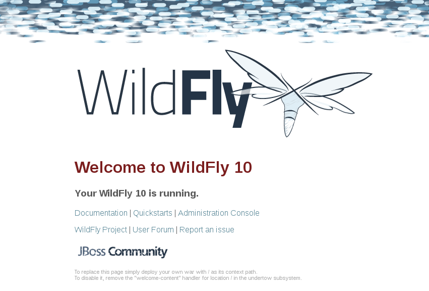

[[Getting_Started_Guide]]
= Getting Started Guide
WildFly team;
:revnumber: {version}
:revdate: {localdate}
:toc: macro
:toclevels: 3
:toc-title: Getting Started Guide
:doctype: book
:icons: font
:source-highlighter: coderay

ifndef::ebook-format[:leveloffset: 1]

(C) 2017 The original authors.

ifdef::basebackend-html[toc::[]]
:numbered:

[[getting-started-with-wildfly]]
== Getting Started with WildFly {wildflyVersion}

WildFly {wildflyVersion} is the latest release in a series of JBoss open-source
application server offerings. WildFly {wildflyVersion} is an exceptionally fast,
lightweight and powerful implementation of the Java Enterprise Edition {javaee_version}
Platform specifications. The state-of-the-art architecture built on the
Modular Service Container enables services on-demand when your
application requires them. The table below lists the Java Enterprise
Edition {javaee_version} technologies and the technologies available in WildFly {wildflyVersion}
server configuration profiles.

[cols=",,,,",options="header"]
|=======================================================================
|Java EE {javaee_version} Platform Technology |Java EE {javaee_version} Full Profile |Java EE {javaee_version} Web
Profile |WildFly {wildflyVersion} Full Profile |WildFly {wildflyVersion} Web Profile

|JSR-356: Java API for Web Socket |X |X |X |X

|JSR-374: Java API for JSON Processing 1.1 |X |X |X |X

|JSR-367: Java API for JSON Binding 1.0 |X |X |X |X

|JSR-369: Java Servlet 4.0 |X |X |X |X

|JSR-372: JavaServer Faces 2.3 |X |X |X |X

|JSR-341: Expression Language 3.0 |X |X |X |X

|JSR-245: JavaServer Pages 2.3 |X |X |X |X

|JSR-52: Standard Tag Library for JavaServer Pages (JSTL) 1.2 |X |X |X
|X

|JSR-352: Batch Applications for the Java Platform 1.0 |X |-- |X |--

|JSR-236: Concurrency Utilities for Java EE 1.0 |X |X |X |X

|JSR-365: Contexts and Dependency Injection for Java 2.0 |X |X |X |X

|JSR-330: Dependency Injection for Java 1.0 |X |X |X |X

|JSR-380: Bean Validation 2.0 |X |X |X |X

|JSR-345: Enterprise JavaBeans 3.2 |XCMP 2.0Optional |X(Lite) |XCMP
2.0Not Available |X(Lite)

|JSR-318: Interceptors 1.2 |X |X |X |X

|JSR-322: Java EE Connector Architecture 1.7 |X |-- |X |X

|JSR-338: Java Persistence 2.2 |X |X |X |X

|JSR-250: Common Annotations for the Java Platform 1.3 |X |X |X |X

|JSR-343: Java Message Service API 2.0 |X |-- |X |--

|JSR-907: Java Transaction API 1.2 |X |X |X |X

|JSR-919: JavaMail 1.6 |X |-- |X |X

|JSR-370: Java API for RESTFul Web Services 2.1 |X |X |X |X

|JSR-109: Implementing Enterprise Web Services 1.3 |X |-- |X |--

|JSR-224: Java API for XML-Based Web Services 2.3 |X |X |X |X

|JSR-181: Web Services Metadata for the Java Platform |X |-- |X |--

|JSR-101: Java API for XML-Based RPC 1.1 |Optional |-- |-- |--

|JSR-67: Java APIs for XML Messaging 1.3 |X |-- |X |--

|JSR-93: Java API for XML Registries |Optional |-- |-- |--

|JSR-222: Java Architecture for XML Binding (JAXB) 2.3 |X |X |X |X

|JSR-196: Java Authentication Service Provider Interface for Containers
1.1 |X |-- |X |--

|JSR-115: Java Authorization Contract for Containers 1.5 |X |-- |X |--

|JSR-88: Java EE Application Deployment 1.2 |Optional |-- |-- |--

|JSR-77: J2EE Management 1.1 |X |  |X | 

|JSR-45: Debugging Support for Other Languages 1.0 |X |X |X |X

|JSR-375: Java EE Security API 1.0 |X |X |X |X
|=======================================================================

Missing HornetQ and JMS?

[WARNING]

The WildFly Web Profile doesn't include JMS (provided by HornetQ) by
default. If you want to use messaging, make sure you start the server
using the "Full Profile" configuration.

This document provides a quick overview on how to download and get
started using WildFly {wildflyVersion} for your application development. For in-depth
content on administrative features, refer to the WildFly {wildflyVersion} Admin Guide.

[[download]]
=== Download

WildFly {wildflyVersion} distributions can be obtained from:

http://www.wildfly.org/downloads/[wildfly.org/downloads]

WildFly {wildflyVersion} provides a single distribution available in zip or tar file
formats.

* *wildfly-{wildflyVersion}.0.0.Final.zip*
* *wildfly-{wildflyVersion}.0.0.Final.tar.gz*

[[requirements]]
=== Requirements

* Java SE 8 or later (we recommend that you use the latest update
available)

[[installation]]
=== Installation

Simply extract your chosen download to the directory of your choice. You
can install WildFly {wildflyVersion} on any operating system that supports the zip or
tar formats. Refer to the Release Notes for additional information
related to the release.

[[wildfly---a-quick-tour]]
=== WildFly - A Quick Tour

Now that you've downloaded WildFly {wildflyVersion}, the next thing to discuss is the
layout of the distribution and explore the server directory structure,
key configuration files, log files, user deployments and so on. It's
worth familiarizing yourself with the layout so that you'll be able to
find your way around when it comes to deploying your own applications.

[[wildfly-directory-structure]]
==== WildFly Directory Structure

[cols=",",options="header"]
|=======================================================================
|DIRECTORY |DESCRIPTION

|appclient |Configuration files, deployment content, and writable areas
used by the application client container run from this installation.

|bin |Start up scripts, start up configuration files and various command
line utilities like Vault, add-user and Java diagnostic reportavailable
for Unix and Windows environments

|bin/client |Contains a client jar for use by non-maven based clients.

|docs/schema |XML schema definition files

|docs/examples/configs |Example configuration files representing
specific use cases

|domain |Configuration files, deployment content, and writable areas
used by the domain mode processes run from this installation.

|modules |WildFly is based on a modular classloading architecture.
The various modules used in the server are stored here.

|standalone |Configuration files, deployment content, and writable areas
used by the single standalone server run from this installation.

|welcome-content |Default Welcome Page content
|=======================================================================

[[standalone-directory-structure]]
===== Standalone Directory Structure

In " *_standalone_* " mode each WildFly {wildflyVersion} server instance is an
independent process (similar to previous JBoss AS versions; e.g., 3, 4,
5, or 6). The configuration files, deployment content and writable areas
used by the single standalone server run from a WildFly installation are
found in the following subdirectories under the top level "standalone"
directory:

[cols=",",options="header"]
|=======================================================================
|DIRECTORY |DESCRIPTION

|configuration |Configuration files for the standalone server that runs
off of this installation. All configuration information for the running
server is located here and is the single place for configuration
modifications for the standalone server.

|data |Persistent information written by the server to survive a restart
of the server

|deployments |End user deployment content can be placed in this
directory for automatic detection and deployment of that content into
the server's runtime.NOTE: The server's management API is recommended
for installing deployment content. File system based deployment scanning
capabilities remain for developer convenience.

|lib/ext |Location for installed library jars referenced by applications
using the Extension-List mechanism

|log |standalone server log files

|tmp |location for temporary files written by the server

|tmp/auth |Special location used to exchange authentication tokens with
local clients so they can confirm that they are local to the running AS
process.
|=======================================================================

[[domain-directory-structure]]
===== Domain Directory Structure

A key feature of WildFly {wildflyVersion} is the managing multiple servers from a
single control point. A collection of multiple servers are referred to
as a " *_domain_* ". Domains can span multiple physical (or virtual)
machines with all WildFly instances on a given host under the control of
a Host Controller process. The Host Controllers interact with the Domain
Controller to control the lifecycle of the WildFly instances running on
that host and to assist the Domain Controller in managing them. The
configuration files, deployment content and writeable areas used by
domain mode processes run from a WildFly installation are found in the
following subdirectories under the top level "domain" directory:

[cols=",",options="header"]
|=======================================================================
|DIRECTORY |DESCRIPTION

|configuration |Configuration files for the domain and for the Host
Controller and any servers running off of this installation. All
configuration information for the servers managed wtihin the domain is
located here and is the single place for configuration information.

|content |an internal working area for the Host Controller that controls
this installation. This is where it internally stores deployment
content. This directory is not meant to be manipulated by end users.Note
that "domain" mode does not support deploying content based on scanning
a file system.

|lib/ext |Location for installed library jars referenced by applications
using the Extension-List mechanism

|log |Location where the Host Controller process writes its logs. The
Process Controller, a small lightweight process that actually spawns the
other Host Controller process and any Application Server processes also
writes a log here.

|servers |Writable area used by each Application Server instance that
runs from this installation. Each Application Server instance will have
its own subdirectory, created when the server is first started. In each
server's subdirectory there will be the following subdirectories:data --
information written by the server that needs to survive a restart of the
serverlog -- the server's log filestmp -- location for temporary files
written by the server

|tmp |location for temporary files written by the server

|tmp/auth |Special location used to exchange authentication tokens with
local clients so they can confirm that they are local to the running AS
process.
|=======================================================================

[[wildfly-10-configurations]]
==== WildFly {wildflyVersion} Configurations

[[standalone-server-configurations]]
===== Standalone Server Configurations

* standalone.xml (_default_)
** Java Enterprise Edition {javaee_version} web profile certified configuration with
the required technologies plus those noted in the table above.

* standalone-ha.xml
** Java Enterprise Edition {javaee_version} web profile certified configuration with
high availability

* standalone-full.xml
** Java Enterprise Edition {javaee_version} full profile certified configuration
including all the required EE {javaee_version} technologies

* standalone-full-ha.xml
** Java Enterprise Edition {javaee_version} full profile certified configuration with
high availability

[[domain-server-configurations]]
===== Domain Server Configurations

* domain.xml
** Java Enterprise Edition {javaee_version} full and web profiles available with or
without high availability

Important to note is that the *_domain_* and *_standalone_* modes
determine how the servers are managed not what capabilities they
provide.

[[starting-wildfly-10]]
==== Starting WildFly {wildflyVersion}

To start WildFly {wildflyVersion} using the default web profile configuration in "
_standalone_" mode, change directory to $JBOSS_HOME/bin.

[source]
----
./standalone.sh
----

To start the default web profile configuration using domain management
capabilities,

[source]
----
./domain.sh
----

[[starting-wildfly-with-an-alternate-configuration]]
==== Starting WildFly with an Alternate Configuration

If you choose to start your server with one of the other provided
configurations, they can be accessed by passing the --server-config
argument with the server-config file to be used.

To use the full profile with clustering capabilities, use the following
syntax from $JBOSS_HOME/bin:

[source, bash]
----
./standalone.sh --server-config=standalone-full-ha.xml
----

Similarly to start an alternate configuration in _domain_ mode:

[source, bash]
----
./domain.sh --domain-config=my-domain-configuration.xml
----

Alternatively, you can create your own selecting the additional
subsystems you want to add, remove, or modify.

[[test-your-installation]]
===== Test Your Installation

After executing one of the above commands, you should see output similar
to what's shown below.

[source, bash]
----
=========================================================================
 
  JBoss Bootstrap Environment
 
  JBOSS_HOME: /opt/wildfly-10.0.0.Final
 
  JAVA: java
 
  JAVA_OPTS:  -server -Xms64m -Xmx512m -XX:MetaspaceSize=96M -XX:MaxMetaspaceSize=256m -Djava.net.preferIPv4Stack=true -Djboss.modules.system.pkgs=com.yourkit,org.jboss.byteman -Djava.awt.headless=true
 
=========================================================================
 
11:46:11,161 INFO  [org.jboss.modules] (main) JBoss Modules version 1.5.1.Final
11:46:11,331 INFO  [org.jboss.msc] (main) JBoss MSC version 1.2.6.Final
11:46:11,391 INFO  [org.jboss.as] (MSC service thread 1-6) WFLYSRV0049: WildFly Full 10.0.0.Final (WildFly Core 2.0.10.Final) starting
<snip>
11:46:14,300 INFO  [org.jboss.as] (Controller Boot Thread) WFLYSRV0025: WildFly Full 10.0.0.Final (WildFly Core 2.0.10.Final) started in 1909ms - Started 267 of 553 services (371 services are lazy, passive or on-demand)
----

As with previous WildFly releases, you can point your browser to
*_http://localhost:8080_* (if using the default configured http port)
which brings you to the Welcome Screen:

From here you can access links to the WildFly community documentation
set, stay up-to-date on the latest project information, have a
discussion in the user forum and access the enhanced web-based
Administration Console. Or, if you uncover a defect while using WildFly,
report an issue to inform us (attached patches will be reviewed). This
landing page is recommended for convenient access to information about
WildFly {wildflyVersion} but can easily be replaced with your own if desired.

[[managing-your-wildfly-10]]
==== Managing your WildFly {wildflyVersion}

WildFly {wildflyVersion} offers two administrative mechanisms for managing your
running instance:

* web-based Administration Console
* command-line interface

===== Authentication

By default WildFly {wildflyVersion} is now distributed with security enabled for the
management interfaces, this means that before you connect using the
administration console or remotely using the CLI you will need to add a
new user, this can be achieved simply by using the _add-user.sh_ script
in the bin folder.

After starting the script you will be guided through the process to add
a new user: -

[source, java]
----
./add-user.sh
What type of user do you wish to add?
 a) Management User (mgmt-users.properties)
 b) Application User (application-users.properties)
(a):
----

In this case a new user is being added for the purpose of managing the
servers so select option a.

You will then be prompted to enter the details of the new user being
added: -

[source, bash]
----
Enter the details of the new user to add.
Realm (ManagementRealm) :
Username :
Password :
Re-enter Password :
----

It is important to leave the name of the realm as 'ManagementRealm' as
this needs to match the name used in the server's configuration, for the
remaining fields enter the new username, password and password
confirmation.

Provided there are no errors in the values entered you will then be
asked to confirm that you want to add the user, the user will be written
to the properties files used for authentication and a confirmation
message will be displayed.

The modified time of the properties files are inspected at the time of
authentication and the files reloaded if they have changed, for this
reason you do not need to re-start the server after adding a new user.

[[administration-console]]
===== Administration Console

To access the web-based Administration Console, simply follow the link
from the Welcome Screen. To directly access the Management Console,
point your browser at:

*_http://localhost:9990/console_*

NOTE: port 9990 is the default port configured.

[source, xml]
----
<management-interfaces>
   <native-interface security-realm="ManagementRealm">
      <socket-binding native="management-native"/>
   </native-interface>
   <http-interface security-realm="ManagementRealm">
      <socket-binding http="management-http"/>
   </http-interface>
</management-interfaces>
----

If you modify the _management-http_ socket binding in your running
configuration: adjust the above command accordingly. If such
modifications are made, then the link from the Welcome Screen will also
be inaccessible.

If you have not yet added at least one management user an error page
will be displayed asking you to add a new user, after a user has been
added you can click on the 'Try Again' link at the bottom of the error
page to try connecting to the administration console again.

[[command-line-interface]]
===== Command-Line Interface

If you prefer to manage your server from the command line (or batching),
the _jboss-cli.sh_ script provides the same capabilities available via
the web-based UI. This script is accessed from $JBOSS_HOME/bin
directory; e.g.,

[source, bash]
----
$JBOSS_HOME/bin/jboss-cli.sh --connect
Connected to standalone controller at localhost:9990
----

Notice if no host or port information provided, it will default to
localhost:9990.

When running locally to the WildFly process the CLI will silently
authenticate against the server by exchanging tokens on the file system,
the purpose of this exchange is to verify that the client does have
access to the local file system. If the CLI is connecting to a remote
WildFly installation then you will be prompted to enter the username and
password of a user already added to the realm.

Once connected you can add, modify, remove resources and deploy or
undeploy applications. For a complete list of commands and command
syntax, type *_help_* once connected.

[[modifying-the-example-datasource]]
==== Modifying the Example DataSource

As with previous JBoss application server releases, a default data
source, *_ExampleDS_* , is configured using the embedded H2 database for
developer convenience. There are two ways to define datasource
configurations:

1.  as a module
2.  as a deployment

In the provided configurations, H2 is configured as a module. The module
is located in the $JBOSS_HOME/modules/com/h2database/h2 directory. The
H2 datasource configuration is shown below.

[source, xml]
----
<subsystem xmlns="urn:jboss:domain:datasources:1.0">
    <datasources>
        <datasource jndi-name="java:jboss/datasources/ExampleDS" pool-name="ExampleDS">
            <connection-url>jdbc:h2:mem:test;DB_CLOSE_DELAY=-1</connection-url>
            <driver>h2</driver>
            <pool>
                <min-pool-size>10</min-pool-size>
                <max-pool-size>20</max-pool-size>
                <prefill>true</prefill>
            </pool>
            <security>
                <user-name>sa</user-name>
                <password>sa</password>
            </security>
        </datasource>
        <xa-datasource jndi-name="java:jboss/datasources/ExampleXADS" pool-name="ExampleXADS">
           <driver>h2</driver>
           <xa-datasource-property name="URL">jdbc:h2:mem:test</xa-datasource-property>
           <xa-pool>
                <min-pool-size>10</min-pool-size>
                <max-pool-size>20</max-pool-size>
                <prefill>true</prefill>
           </xa-pool>
           <security>
                <user-name>sa</user-name>
                <password>sa</password>
           </security>
        </xa-datasource>
        <drivers>
            <driver name="h2" module="com.h2database.h2">
                <xa-datasource-class>org.h2.jdbcx.JdbcDataSource</xa-datasource-class>
            </driver>
        </drivers>
  </datasources>
</subsystem>
----

The datasource subsystem is provided by the
http://www.jboss.org/ironjacamar[IronJacamar] project. For a detailed
description of the available configuration properties, please consult
the project documentation.

* IronJacamar homepage: http://www.jboss.org/ironjacamar
* Project Documentation: http://www.jboss.org/ironjacamar/docs
* Schema description:
http://docs.jboss.org/ironjacamar/userguide/1.0/en-US/html/deployment.html#deployingds_descriptor

[[configure-logging-in-wildfly]]
===== Configure Logging in WildFly

WildFly logging can be configured with the web console or the command
line interface. You can get more detail on the link:Admin_Guide{outfilesuffix}#Logging[Logging
Configuration] page.

Turn on debugging for a specific category with CLI:

[source, ruby]
----
/subsystem=logging/logger=org.jboss.as:add(level=DEBUG)
----

By default the `server.log` is configured to include all levels in it's
log output. In the above example we changed the console to also display
debug messages.
